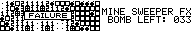

# MINE SWEEPER FX

## 動作環境

FX-890PとZ-1GRで動作確認しました。Z-1でも動きます。（推測）

## 入力方法

まず、マシン語エリアを&H1AB6以上確保します。

```
CLEAR 1024,6838,10240
```

次に、プログラムリストをRUNして下さい。プログラム本体は、2000Hから2B52Hまでの2899バイトです。

実行は

```
DEFSEG=0
CALL&H2000
```

です。アドレスに注意してください。このプログラムはリロケータブルではありませんので、必ず指定されたアドレスに読み込んでください。

## 遊びかた

プログラムを走らせると、タイトルが表示され、レベルの選択画面になります。[EASY] [NORMAL] [HARD]の順に難しくなります。ここで、[CUSTOM]を選ぶと、縦横のマスの大きさと爆弾数が変更できます。Ｘ方向は6から20まで、Ｙ方向は6から49まで、爆弾は、(Y-1)*X-1個まで設定できますが、半分以上爆弾になると、かなり難しくなります。

タイトルと[CUSTOM]では、テンキーでカーソル移動、数字を増やしたり減らしたりするのは[4][6]キー、[RET]で決定です。

ゲーム画面では、カーソルは反転しているものでテンキーで移動します。爆弾を掘るとき（ＷＩＮ版の左クリックに相当）は[S]、フラグを立てる（右クリックに相当）ときは[A]、周りのマスを一度に開く（同時クリックに相当）のは、掘ったマスの上で[S]です。

ルールは説明するまでもないとおもいますが、念のため説明します。あるマスに書かれている数字は、そのマスの周りにある爆弾の数を示しています。その数を手掛かりにして、すべての爆弾の上にフラグを立てるのが目的です。

クリア条件は「爆弾のないマスを全て掘る」ことです。まわりに爆弾のないマスを掘ったときには、自動的にその周りのマスを掘り進んでくれます。クリアした、又はゲームオーバーになったときは、[RET]でもう一度同じ広さのマスでゲーム、[CLS]を押すとタイトルに戻ります。

一度このゲームにはまってしまうと徹夜が待っています。「あなたの健康のために、遊びすぎに注意しましょう」

## プログラムについて

ポケコンの狭い画面を克服するためにいろいろ工夫をしています。

BIOSを使って画面表示をすると4行しか表示できませんが、LCDCを直接操作して、6行表示にしています。それでもまだ狭いので、スクロールしてたくさん表示できるようにしています。スクロールしても、見えないところもきちんと処理していますので大丈夫です。

でも、あまり情報量を必要としない右側は4行表示にすることにより、画面の見づらさはそんなに無いと思います。

## スクリーンショット





## Q&A

お待ちかねのQ&Aのコーナーです。今日は「マインスイーパーで空白のマスを掘ったときに自動的に周りのマスを掘り進むアルゴリズムはどうなっているのですか」と言うものです。

このプログラムで採用したルーチンは次のとおりです。

まず、プレーヤーが掘ったマスを自分のマスと呼びます。あるマスに接している８個のマスは周りのマスと呼びます。自分のマスに接している爆弾の数が０個の時、自分のマスの座標を基準にして、上、右上、右、右下、下、左下、左、左上の順に、周りのマスに接している爆弾の数を調べます。もし、周りのマスに接している爆弾の数が０個ならば、基準のマスをそのマスにして、再帰的に、接している爆弾の数が０個のマスを探します。このとき、基準のマスは順番に記録しておきます。もちろん、高速化のため、一度周りの爆弾の数を探したマスは２度目以降は飛ばします。もし、爆弾の数が０個でなければ、そのマスを掘ってしまいますが、基準のマスは変えません。

これを続けていくと、周りのマスは全て処理してしまった、という状態にぶつかります。このようなときは、記録しておいた基準のマスを呼び出して（つまり１歩手前に戻る）、さらに周りのマスを調べていくわけです。このようにして、自分のマスに処理が戻ってきたら、自動的にマスを展開したことになるわけです。

このアルゴの難点は、メモリを大量に消費することです。実質やってることは再帰呼び出しですから。でも最近のポケコンはメモリをいっぱい載っけているので大丈夫でしょう、多分。

具体例

例えば、爆弾が次のように埋まっているとします。

```
・・・・・・・・
・■・・・・・・
・・・・・・■・
・■・・・・・・
・・・・・■・・
```

・は空のマス、■は爆弾の埋まっているマスです。周りの数字を記入すると次のようになります。

```
１１１・・・・・
１■１・・１１１
２２２・・１■１
１■１・１２２１
１１１・１■１・
```

今、Ｐ印のマスを掘ったとしましょう。

```
・・・・・・・・
・■・・・・・・
・・・・Ｐ・■・
・■・・・・・・
・・・・・■・・
```

結果として、次のように展開できれば成功です。

```
・・１×××××
・■１××１１１
・・２×Ｐ１■・
・■１×１２・・
・・１×１■・・
```

まず、掘ったマスの周りにある爆弾の数が０でなければ、ここで終わりです。その時は自動展開しなくていいんですからね。ここでは、０なので次に進みます。
まず、自分のマスの座標を記録します。（終了判定用）
次にその上のマスの周りにある爆弾の数を調べます。また０なので、元の座標と、調べていた方向を記録し、掘って、そのマスにカーソルを移動させます。

```
カーソル「Ｘ＝４、Ｙ＝１、上」
・・・・・・・・  （１）Ｘ＝４、Ｙ＝２、？
・■・・×・・・  （２）Ｘ＝４、Ｙ＝２、上
・・・・×・■・
・■・・・・・・
・・・・・■・・
```

さらに上のマスの周りの爆弾数が０なので、掘って、上に移動します。もちろん座標は記憶します。

```
カーソル「Ｘ＝４、Ｙ＝０、上」
・・・・×・・・  （１）Ｘ＝４、Ｙ＝２、？
・■・・×・・・  （２）Ｘ＝４、Ｙ＝２、上
・・・・×・■・  （３）Ｘ＝４、Ｙ＝１、上
・■・・・・・・
・・・・・■・・
```

さて、今度は、上には行けません。上にマスが存在しないときは、時計周り、つまり上、右上、右、右下、下、左下、左、左上の順に移動できるかどうか調べていきます。今回は、右に行けますね。自分の座標と移動方向を記録して、掘って、カーソルを移動します。

```
カーソル「Ｘ＝５、Ｙ＝０、上」
・・・・××・・  （１）Ｘ＝４、Ｙ＝２、？
・■・・×・・・  （２）Ｘ＝４、Ｙ＝２、上
・・・・×・■・  （３）Ｘ＝４、Ｙ＝１、上
・■・・・・・・  （４）Ｘ＝４、Ｙ＝０、右
・・・・・■・・
```

あと２回右に行きます。

```
カーソル「Ｘ＝７、Ｙ＝０、上」
・・・・××××  （１）Ｘ＝４、Ｙ＝２、？    （６）Ｘ＝６、Ｙ＝０、右
・■・・×・・・  （２）Ｘ＝４、Ｙ＝２、上
・・・・×・■・  （３）Ｘ＝４、Ｙ＝１、上
・■・・・・・・  （４）Ｘ＝４、Ｙ＝０、右
・・・・・■・・  （５）Ｘ＝５、Ｙ＝０、右
```

次は、時計周りに見ていくと、下にはマスがありますね。でも０ではありません。このようなときは、下のマスを掘るだけ掘って、カーソルはそのままにしておきます。座標移動しないので、座標の記録はしません。

```
カーソル「Ｘ＝７、Ｙ＝０、下」
・・・・××××  （１）Ｘ＝４、Ｙ＝２、？    （６）Ｘ＝６、Ｙ＝０、右
・■・・×・・１  （２）Ｘ＝４、Ｙ＝２、上
・・・・×・■・  （３）Ｘ＝４、Ｙ＝１、上
・■・・・・・・  （４）Ｘ＝４、Ｙ＝０、右
・・・・・■・・  （５）Ｘ＝５、Ｙ＝０、右
```

同様に、左下も掘ります。

```
カーソル「Ｘ＝７、Ｙ＝０、左下」
・・・・××××  （１）Ｘ＝４、Ｙ＝２、？    （６）Ｘ＝６、Ｙ＝０、右
・■・・×・１１  （２）Ｘ＝４、Ｙ＝２、上
・・・・×・■・  （３）Ｘ＝４、Ｙ＝１、上
・■・・・・・・  （４）Ｘ＝４、Ｙ＝０、右
・・・・・■・・  （５）Ｘ＝５、Ｙ＝０、右
```

今カーソルのあるマスの左のマスのように、一度処理したマスは、２回目以降は処理しません。これは、別のワークエリアに処理したかどうかのフラグを立ててやればいいのです。

さて、左上のマスは存在しないことですし、行くところがなくなってしまいました。どうしましょう。この時のために座標を記録しておいたのです。行き詰まってしまったら一歩手前に戻ればいいのです。よって、（６）のデータを読みだします。よって、カーソルを「Ｘ＝６、Ｙ＝０、右」とします。時計周りに見ていくと左下が掘れますね。

```
カーソル「Ｘ＝６、Ｙ＝０、左下」
・・・・××××  （１）Ｘ＝４、Ｙ＝２、？
・■・・×１１１  （２）Ｘ＝４、Ｙ＝２、上
・・・・×・■・  （３）Ｘ＝４、Ｙ＝１、上
・■・・・・・・  （４）Ｘ＝４、Ｙ＝０、右
・・・・・■・・  （５）Ｘ＝５、Ｙ＝０、右
```

また、行き詰まったので戻っていきます。２回戻ります。

```
カーソル「Ｘ＝４、Ｙ＝０、右」
・・・・××××  （１）Ｘ＝４、Ｙ＝２、？
・■・・×１１１  （２）Ｘ＝４、Ｙ＝２、上
・・・・×・■・  （３）Ｘ＝４、Ｙ＝１、上
・■・・・・・・
・・・・・■・・
```

時計周りに見ると、左下に移動できます。そのマスの周りの爆弾の数は０なので掘ります。

```
カーソル「Ｘ＝３、Ｙ＝１、上」
・・・・××××  （１）Ｘ＝４、Ｙ＝２、？
・■・××１１１  （２）Ｘ＝４、Ｙ＝２、上
・・・・×・■・  （３）Ｘ＝４、Ｙ＝１、上
・■・・・・・・  （４）Ｘ＝４、Ｙ＝０、左下
・・・・・■・・
```

お解りいただけたでしょうか。以下、説明を簡略化して続けていきます。上に行きます。

```
カーソル「Ｘ＝３、Ｙ＝０、上」
・・・×××××  （１）Ｘ＝４、Ｙ＝２、？
・■・××１１１  （２）Ｘ＝４、Ｙ＝２、上
・・・・×・■・  （３）Ｘ＝４、Ｙ＝１、上
・■・・・・・・  （４）Ｘ＝４、Ｙ＝０、左下
・・・・・■・・  （５）Ｘ＝３、Ｙ＝１、上
```

左下を開きます。

```
カーソル「Ｘ＝３、Ｙ＝０、左下」
・・・×××××  （１）Ｘ＝４、Ｙ＝２、？
・■１××１１１  （２）Ｘ＝４、Ｙ＝２、上
・・・・×・■・  （３）Ｘ＝４、Ｙ＝１、上
・■・・・・・・  （４）Ｘ＝４、Ｙ＝０、左下
・・・・・■・・  （５）Ｘ＝３、Ｙ＝１、上
```

左も開きます。

```
カーソル「Ｘ＝３、Ｙ＝０、左」
・・１×××××  （１）Ｘ＝４、Ｙ＝２、？
・■１××１１１  （２）Ｘ＝４、Ｙ＝２、上
・・・・×・■・  （３）Ｘ＝４、Ｙ＝１、上
・■・・・・・・  （４）Ｘ＝４、Ｙ＝０、左下
・・・・・■・・  （５）Ｘ＝３、Ｙ＝１、上
```

（５）を呼び出します。その状態から下に行きます。

```
カーソル「Ｘ＝３、Ｙ＝２、上」
・・１×××××  （１）Ｘ＝４、Ｙ＝２、？
・■１××１１１  （２）Ｘ＝４、Ｙ＝２、上
・・・××・■・  （３）Ｘ＝４、Ｙ＝１、上
・■・・・・・・  （４）Ｘ＝４、Ｙ＝０、左下
・・・・・■・・  （５）Ｘ＝３、Ｙ＝１、下
```

右下を開きますよ。

```
カーソル「Ｘ＝３、Ｙ＝２、右下」
・・１×××××  （１）Ｘ＝４、Ｙ＝２、？
・■１××１１１  （２）Ｘ＝４、Ｙ＝２、上
・・・××・■・  （３）Ｘ＝４、Ｙ＝１、上
・■・・１・・・  （４）Ｘ＝４、Ｙ＝０、左下
・・・・・■・・  （５）Ｘ＝３、Ｙ＝１、下
```

下に移動です。

```
カーソル「Ｘ＝３、Ｙ＝３、上」
・・１×××××  （１）Ｘ＝４、Ｙ＝２、？    （６）Ｘ＝３、Ｙ＝２、下
・■１××１１１  （２）Ｘ＝４、Ｙ＝２、上
・・・××・■・  （３）Ｘ＝４、Ｙ＝１、上
・■・×１・・・  （４）Ｘ＝４、Ｙ＝０、左下
・・・・・■・・  （５）Ｘ＝３、Ｙ＝１、下
```

右下を開き、下に移動です。

```
カーソル「Ｘ＝３、Ｙ＝４、上」
・・１×××××  （１）Ｘ＝４、Ｙ＝２、？    （６）Ｘ＝３、Ｙ＝２、下
・■１××１１１  （２）Ｘ＝４、Ｙ＝２、上    （７）Ｘ＝３、Ｙ＝３、下
・・・××・■・  （３）Ｘ＝４、Ｙ＝１、上
・■・×１・・・  （４）Ｘ＝４、Ｙ＝０、左下
・・・×１■・・  （５）Ｘ＝３、Ｙ＝１、下
```

左と左上を開きます。

```
カーソル「Ｘ＝３、Ｙ＝４、左上」
・・１×××××  （１）Ｘ＝４、Ｙ＝２、？    （６）Ｘ＝３、Ｙ＝２、下
・■１××１１１  （２）Ｘ＝４、Ｙ＝２、上    （７）Ｘ＝３、Ｙ＝３、下
・・・××・■・  （３）Ｘ＝４、Ｙ＝１、上
・■１×１・・・  （４）Ｘ＝４、Ｙ＝０、左下
・・１×１■・・  （５）Ｘ＝３、Ｙ＝１、下
```

（７）を呼び出します。左上を掘ります。

```
カーソル「Ｘ＝３、Ｙ＝３、左上」
・・１×××××  （１）Ｘ＝４、Ｙ＝２、？    （６）Ｘ＝３、Ｙ＝２、下
・■１××１１１  （２）Ｘ＝４、Ｙ＝２、上
・・２××・■・  （３）Ｘ＝４、Ｙ＝１、上
・■１×１・・・  （４）Ｘ＝４、Ｙ＝０、左下
・・１×１■・・  （５）Ｘ＝３、Ｙ＝１、下
```

（６）、（５）、（４）、（３）の順に呼び出します。これらは、周りを調べても、移動するところも掘るところもありません。

```
カーソル「Ｘ＝４、Ｙ＝１、上」
・・１×××××  （１）Ｘ＝４、Ｙ＝２、？
・■１××１１１  （２）Ｘ＝４、Ｙ＝２、上
・・２××・■・
・■１×１・・・
・・１×１■・・
```

右下を開いて、（２）を呼び出します。

```
カーソル「Ｘ＝４、Ｙ＝２、上」
・・１×××××  （１）Ｘ＝４、Ｙ＝２、？
・■１××１１１
・・２××１■・
・■１×１・・・
・・１×１■・・
```

右下を開いて、（１）を呼び出します。

```
カーソル「Ｘ＝４、Ｙ＝２、？」
・・１×××××
・■１××１１１
・・２××１■・
・■１×１２・・
・・１×１■・・
```

ここで、呼び出した座標と元の座標が一致した（つまり、最終的に行き先がなくなった）ので、終わりです。このアルゴリズムだと、どのつながっているマスでも、必ず8方向を調べますので、掘り残すようなことはありません。

実際のプログラムでは、このアルゴリズムを少し応用して自動展開をさせています。この程度のルーチンだとマスの数が多いと処理に時間が掛かりますが、プログラマの腕次第でどうにでもなります。ポケコンのマシン語プログラムだって、数十マスくらいなら一瞬で終わります。ただ、BASICでは無理でしょう。

唯一の欠点は、メモリを大量に消費することです。私の組んだルーチンでは1マスにつき4バイト必要とします（本当は3バイトと1ビット）。

MS-DOSで組めば、仮に80x25=2000マスのマインスイーパーでも2000x4=8000、約8KBです。プログラム本体サイズを足しても使用するメモリはたかが知れています。
